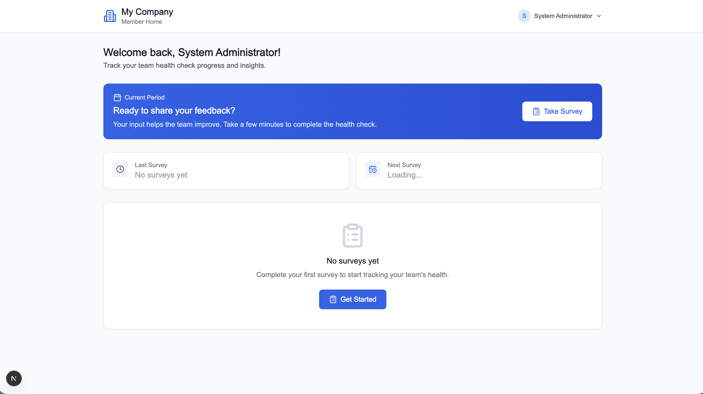
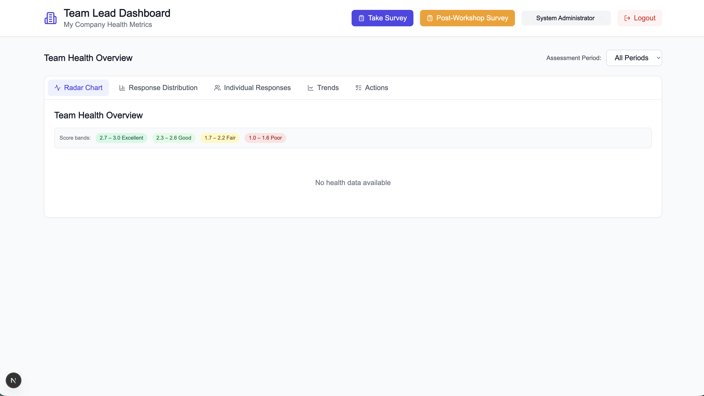
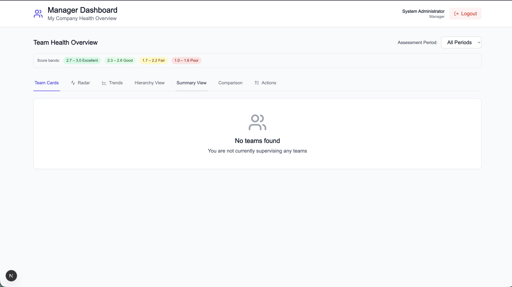
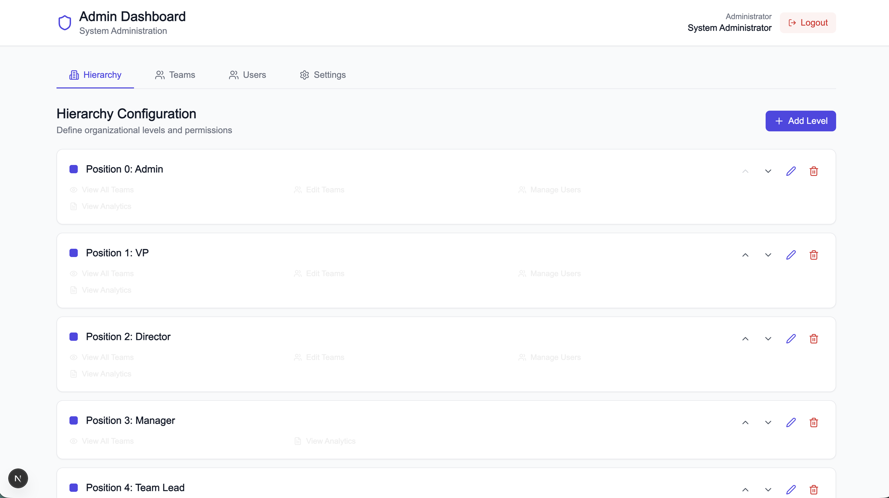

# Team Health Check — Overview

Team Health Check is an open-source team health assessment platform inspired by [Spotify's Squad Health Check Model](https://engineering.atspotify.com/2014/09/squad-health-check-model/). It enables organizations to systematically surface where teams need support and track improvement over time using a simple red / yellow / green scoring system across 11 health dimensions.

---

## What It Does

Team Health Check replaces ad-hoc "how are we doing?" conversations with a structured, repeatable process:

1. **Team members** complete a short survey (11 questions, ~5 minutes) each assessment period.
2. **Team leads** review aggregated results on their dashboard — radar charts, response distributions, and trend lines.
3. **Managers, Directors, and VPs** see roll-up views across all supervised teams, enabling them to spot patterns and allocate support.
4. **Admins** configure the organizational hierarchy, manage users and teams, and tune assessment cadences.

All data is stored in PostgreSQL and exposed via a versioned REST API (`/api/v1/`). The frontend is a Next.js 15 app served on port 3000; the backend is a Go / Gin API served on port 8080.

---

## Who Uses It

| Role | Primary surface | What they do |
|------|----------------|--------------|
| Team Member | `/home`, `/survey` | Complete health check surveys each period |
| Team Lead | `/dashboard` | Review team health, trends, and individual responses |
| Manager | `/manager` | View aggregated health across supervised teams |
| Director / VP | `/manager` | Organization-wide health overview |
| Admin | `/admin` | Configure hierarchy, users, teams, dimensions |

---

## Key Problems It Solves

- **Organizational blind spots**: Managers rarely know which teams are struggling with delivery speed, code health, or psychological safety until it is too late. Team Health Check makes these signals visible on a regular cadence.
- **Guessing at root causes**: Without structured data, improvement efforts are hit-or-miss. The 11-dimension model pinpoints which area needs attention.
- **Lack of trend visibility**: One-off surveys are forgotten. Team Health Check plots assessment periods (e.g., "2025 - 1st Half", "2024 - 2nd Half") so you can see whether changes are working.
- **Distributed teams**: Spotify's original model requires in-person workshops. Team Health Check enables fully asynchronous participation for distributed organizations.

---

## Core Philosophy

> Health checks are a **support tool**, not a performance evaluation mechanism.

- **"Red" means "needs help"**, not "bad team". A red score in Delivery Speed triggers a conversation about blockers, not a performance review.
- **Trust-based**: The system relies on honest self-assessment. Never use individual responses to evaluate employees.
- **Flexible**: Hierarchies, dimensions, and cadences are all configurable to fit your organization's structure.

---

## Health Dimensions

Teams assess themselves across 11 dimensions each period:

| Dimension | Good State | Bad State |
|-----------|-----------|-----------|
| **Mission** | We know exactly why we are here and are excited about it | We have no idea why we are here |
| **Delivering Value** | We deliver great stuff; stakeholders are really happy | We deliver crap; stakeholders hate us |
| **Speed** | We get stuff done quickly; no waiting, no delays | We never seem to get anything done |
| **Fun** | We love going to work and have great fun together | Boring |
| **Health of Codebase** | Clean code, easy to read, great test coverage | Technical debt is raging out of control |
| **Learning** | We are learning lots of interesting stuff all the time | We never have time to learn anything |
| **Support** | We always get great support when we ask for it | We keep getting stuck without help |
| **Pawns or Players** | We control our destiny and decide what to build | We are just pawns with no influence |
| **Easy to Release** | Releasing is simple, safe, painless, and automated | Releasing is risky, painful, and takes forever |
| **Suitable Process** | Our way of working fits us perfectly | Our way of working sucks |
| **Teamwork** | We are a tight-knit team that works together well | We are individuals who do not care about each other |

Score mapping: 1 = Red (needs support), 2 = Yellow (mixed), 3 = Green (healthy).  
Each response also captures a **trend** (improving / stable / declining) and an optional free-text comment.

---

## External Integrations

| Integration | Relationship |
|------|-------------|
| Any OIDC-compliant identity provider (Keycloak, Okta, Auth0, Google, Azure AD, etc.) | Optional SSO login; users must already exist in Team Health Check's DB — SSO does not auto-provision accounts (see [Authentication & Authorization](getting-started/auth.md)) |
| AWS SES / SMTP | Optional email notifications (e.g. password reset) |

---

## Assessment Period Logic

Assessment periods are cadence-driven based on each team's configured cadence:

| Cadence | Format | Example |
|---------|--------|---------|
| **Monthly** | `YYYY Mon` | `2026 Mar` |
| **Quarterly** | `YYYY Q#` | `2026 Q1` |
| **Half-yearly** | `YYYY H#` | `2026 H1` |
| **Yearly** | `YYYY` | `2026` |

> **Legacy format**: Earlier versions generated `YYYY - 1st Half` (Jul–Dec of `YYYY`) and `YYYY - 2nd Half` (Jan–Jun of `YYYY + 1`). This legacy format is still parsed for backward compatibility but is no longer generated.

---

## Screenshots

### Team Member Home

The home screen shows a user's team, their survey history, and a prompt to take the current period's health check.

### Team Lead Dashboard

Team leads see a radar chart across all 11 dimensions, a response-distribution bar chart, and individual member submissions.

### Manager / VP Dashboard

Managers and executives see health cards for each supervised team, a radar comparison across teams, and trend lines across assessment periods.

### Admin Panel

Admins manage users, teams, hierarchy levels, and health dimensions without any code changes.

---

## Quick Links

- [Local Setup Guide](./getting-started/local-setup.md) — get running in under 10 minutes
- [Architecture & Key Flows](./architecture/overview.md) — understand the system
- [Onboarding Checklist](./getting-started/onboarding.md) — Day-1 through Day-5
- [API Reference](./api/endpoints.md) — REST endpoint catalogue
